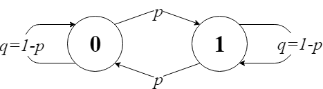

```{r setup, include=FALSE}
knitr::opts_chunk$set(echo = TRUE, error = TRUE)
```

## Chapter 11 Section 1 Exercise 8

A certain calculating machine uses only the digits 0 and 1. It is supposed to
transmit one of these digits through several stages. However, at every stage,
there is a probability $p$ that the digit that enters this stage will be changed
when it leaves and a probability $q = 1-p$ that it won't. Form a Markov chain
to represent the process of transmission by taking as states the digits 0 and 1.
What is the matrix of transition probabilities?

### Solution

We only have 2 states - 0 and 1 - so there are 4 possible transitions. 

<CENTER></CENTER>

This yields the following transition matrix $P$:

$$
\begin{array}{c c} &
\begin{array}{c c} 0 & 1 \\
\end{array} 
\\
\begin{array}{c c}
0\\
1
\end{array} 
&
\left(
\begin{array}{c c}
q & p \\
p & q
\end{array}
\right) 
\end{array}
$$

Each stage described in the problem is a Markov chain transition step. Although the stages may be different, the probabilities are the same, so they all can be represented with a single matrix.
