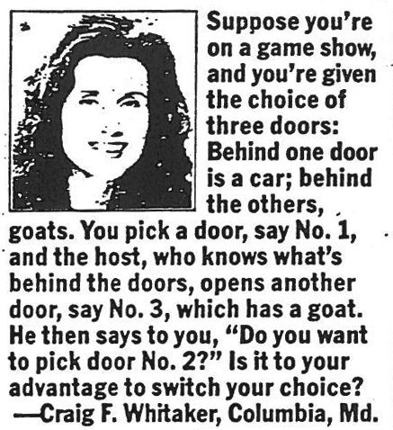

```{r setup, include=FALSE}
knitr::opts_chunk$set(echo = TRUE, error = TRUE)
```

## Chapter 4 Section 1 Exercise 11

This problem as well as Marilyn von Savant's name popped up a few times recenty, so it got my interest. Below is the R simulation which was suggeste by exercise 11.



### Solution

* The function below randomly assigns one of the doors to hide the car. Two other doors hide goats. 
* We assume contestant always starts with door 1. The other two doors either both have goats or one has a goat and the other has a car.
* Regardless what is behind door 1, the host opens another door with a goat (either door 2 or 3).
* Contestant switches his or her choice to remaining door - 2 or 3. Calculate percentage of times the contestant wins.
* With above assumptions, contestant wins if car is behind doors 2  or 3. Contestant looses if car is behind door 1. (At this point it is clear that the contestant will win two thirds of the time since the car will be behind doors 2 or 3 two thirds of the time.)


```{r}
# Monty Hall function
montyhallsim <- function(runs) {
  outcome <- rep(0,n)
  cardoor <- sample(1:3,n,replace=TRUE)
  return (sum(cardoor!=1)/n)
}

# Initialize number of runs per each simulation
n <- 1000

# Run a single simulation
montyhallsim(n)
```

Looks pretty close to 2/3. Let us run more simulations.

```{r}
# Initialize number of simulations
simcount <- 1000

# Run simulations
winper <- replicate(n, montyhallsim(n))

# Plot results
library(ggplot2)
ggplot()+geom_histogram(aes(winper), binwidth=.003)+
  xlab("Winning Percentage")+ylab("")

summary(winper)
```

We can clearly see after `r n` simulations that the probability of winning a car with this stragegy is 2/3 (the mean for this run is `r mean(winper)`.

### Notes

Here is an interesting, 5-minute video explaining a little more history behind the Monty Hall paradox.

<CENTER>
<iframe width="560" height="315" src="https://www.youtube.com/embed/ggDQXlinbME" frameborder="0" allowfullscreen>
</iframe>
</CENTER>