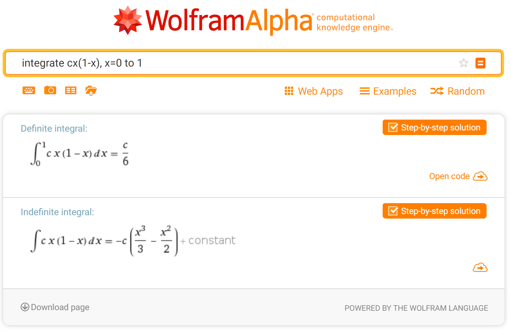

```{r setup, include=FALSE}
knitr::opts_chunk$set(echo = TRUE, error = TRUE)
```

### Chapter 5.2 Exercise 16

Let $X$ be a random variable with density function $f_X(x)=\begin{cases} cx(1-x), &if\ 0 < x < 1,\\0, &otherwise.\end{cases}$

a) What is the value of $c$?
b) What is the cumulative distribution function $F_X$ for $X$?
c) What is the probability that $X < 1/4$?

#### Part (a)

Probability density function must be positive and integrate to $1$.

$\int_{0}^{1}cx(1-x) dx = \frac{c}{6}=1$, then $c=6$.

FYI, I use WolframAlpha to calculate my integrals.

<CENTER>

</CENTER>


So density function is $f_X(x)=\begin{cases} 6x(1-x), &if\ 0 < x < 1,\\0, &otherwise.\end{cases}$

```{r}
library(ggplot2)
x <- seq(from=0,to=1,length.out=1000)
y <- 6*x*(1-x)

# Define polygon for under the curve shading
shade <- rbind(c(0,0), data.frame(x,y), c(1, 0))

ggplot()+
  xlim(0,1.5)+ylim(0,1.5)+coord_fixed()+
  xlab("")+ylab("")+
  geom_line(aes(x,y))+
  geom_line(aes(c(1,1.5),c(0,0)))+
  geom_polygon(aes(shade$x,shade$y), fill="black", alpha=0.3)
```

#### Part (b)

$F_x = \int_{-\infty}^{x} f(t) dt$

$\int f(x) dx = -6 (\frac{x^3}{3}-\frac{x^2}{2}) = -2x^3+3x^2 = x^2(3-2x)$

Cumulative distribution function $F_X(x)=\begin{cases} x^2(3-2x), &if\ 0 < x < 1,\\0, &otherwise.\end{cases}$

#### Part (c)

$P(X < 1/4) = 0.25^2 \times (3-2 \times 0.25) = 0.15625$

```{r}
x <- seq(from=0,to=1,length.out=1000)
y <- 6*x*(1-x)

# Define polygon for under the curve shading
shade1 <- rbind(c(0,0), data.frame(x,y), c(1, 0))
shade2 <- rbind(c(0.0), data.frame(x[x<0.25],y[x<0.25]), c(0.25,0))

ggplot()+
  xlim(0,1.5)+ylim(0,1.5)+coord_fixed()+
  xlab("")+ylab("")+
  geom_line(aes(x,y))+
  geom_line(aes(c(1,1.5),c(0,0)))+
  geom_polygon(aes(shade1$x,shade1$y), fill="black", alpha=0.2)+
  geom_polygon(aes(shade2$x,shade2$y), fill="black", alpha=0.4)+
  geom_text(aes(0.12,0.1), label="0.15625", size=3, color="white", fontface="italic")
```

